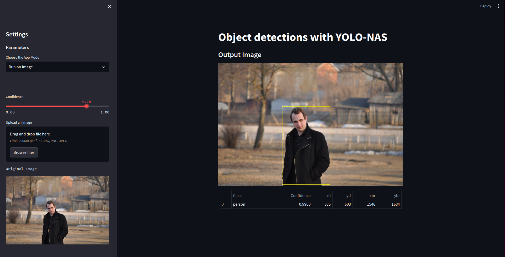

# yolo_nas_object_detection

Using a pre-trained ***YOLO-NAS*** model to detect objects in a photo or video use **streamlit**

### TODO 
- [ ] Update predictions code to Class model
- [ ] Add read rtsp 
- [ ] Add view statst of detectect
